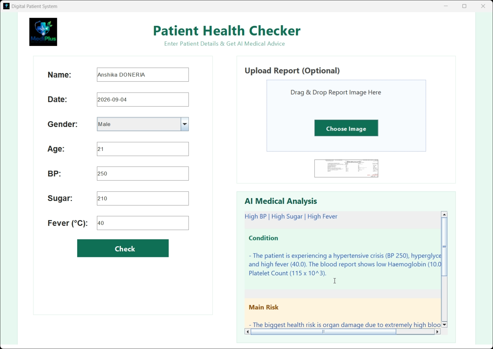

<p align="center">
  
</p>

<h1 align="center">MediPulse</h1>
<p align="center"><i>Your Health, Our Priority</i></p>

<p align="center">
  
  
  
  
  
</p>

<p align="center">
  An AI-assisted patient health monitoring desktop application that logs vitals, analyzes uploaded medical reports, and generates instant, structured medical guidance.
</p>

---

## Table of Contents

- [Overview](#overview)
- [Preview](#preview)
- [Key Features](#key-features)
- [Tech Stack](#tech-stack)
- [Architecture](#architecture)
- [Getting Started](#getting-started)
- [Security](#security)
- [Roadmap](#roadmap)
- [License](#license)

---

## Overview

**MediPulse** is a Java Swing desktop application designed to streamline preliminary patient health assessment. It allows a user to record core vitals — blood pressure, blood sugar, and body temperature — and optionally attach a medical report (image or PDF). The application then queries Google's **Gemini AI model** to generate a concise, structured medical summary covering the patient's **condition**, the **primary health risk**, and **actionable precautions**, alongside a persistent record stored in a MySQL database.

The project was built to explore how generative AI can be integrated responsibly into a lightweight clinical support tool — combining a familiar desktop interface with real-time AI reasoning.

## Preview

<p align="center">
  
</p>

## Key Features

| Feature | Description |
|---|---|
| 🩺 **Vitals Logging** | Capture name, age, gender, date, blood pressure, blood sugar, and fever in a clean form |
| 📄 **Report Upload & Analysis** | Attach a medical report (image/PDF); Gemini reads and incorporates specific values into its analysis |
| 🤖 **AI Medical Summary** | Structured output — *Condition*, *Main Risk*, and *Precautions* — generated per patient in real time |
| 🎨 **Visual Risk Coding** | Each analysis section is rendered in a distinct color panel for fast visual triage |
| 🗄️ **Persistent Records** | Every submission is saved to a MySQL `patients` table for later reference |
| 🌡️ **Automatic Classification** | Vitals are auto-labeled (Normal / Pre-High / High, etc.) using standard medical thresholds |

## Tech Stack

- **Frontend:** Java Swing
- **Backend/Logic:** Core Java (JDK 22)
- **Database:** MySQL (JDBC)
- **AI Engine:** Google Gemini (`gemini-2.5-flash`) via REST API
- **Data Format:** JSON (manual construction/parsing)

## Architecture

```
User Input (Swing UI)
      │
      ├──► MySQL (persist patient record)
      │
      └──► Background Thread ──► Gemini API (prompt + optional report bytes)
                                        │
                                        ▼
                          Structured AI Response (parsed & color-rendered)
```

The AI call runs on a separate thread to keep the UI responsive while waiting on the network response.

## Getting Started

### Prerequisites

- Java JDK 22 or later
- MySQL Server (running locally)
- A [Google AI Studio](https://aistudio.google.com/) API key

### 1. Clone the Repository

```bash
git clone https://github.com/Anshika-Doneria/Medi-Pulse.git
cd Medi-Pulse
```

### 2. Set Up the Database

Create the database and table (adjust credentials in `PatientSystemGUI.java` to match your local MySQL setup):

```sql
CREATE DATABASE patientdb;

USE patientdb;

CREATE TABLE patients (
    id INT AUTO_INCREMENT PRIMARY KEY,
    name VARCHAR(100),
    date DATE,
    gender VARCHAR(20),
    age INT,
    bp INT,
    sugar INT,
    fever FLOAT
);
```

### 3. Configure Environment Variables

```bash
setx GOOGLE_API_KEY "your_google_api_key_here"
setx DB_PASSWORD "your_mysql_password_here"
```

> Restart your terminal/IDE after setting environment variables so they take effect.

### 4. Compile

```bash
cd src
javac -d ../out -cp ".;../lib/mysql-connector-j-x.x.x.jar" PatientSystemGUI.java
```

### 5. Run

```bash
cd ../out
java -cp ".;../lib/mysql-connector-j-x.x.x.jar" PatientSystemGUI
```

## Security

- Database credentials and the Gemini API key are read exclusively from **environment variables** — never hardcoded or committed to source control.
- Uploaded reports and prompts may contain sensitive health information; ensure appropriate consent and secure handling before deploying beyond local/educational use.
- For production use, consider OAuth-based service account tokens over static API keys.

## Roadmap

- [ ] Export patient history to PDF
- [ ] Add BMI calculation and tracking
- [ ] Multi-user authentication
- [ ] Migrate to a web-based interface

## License

This project is open source and intended for educational and portfolio purposes.

---

<p align="center">Built with care by <a href="https://github.com/Anshika-Doneria">Anshika Doneria</a></p>
<p align="center">
  
</p>

<h1 align="center">MediPulse</h1>
<p align="center"><i>Your Health, Our Priority</i></p>

<p align="center">
  
  
  
  
  
</p>

<p align="center">
  An AI-assisted patient health monitoring desktop application that logs vitals, analyzes uploaded medical reports, and generates instant, structured medical guidance.
</p>

---

## Table of Contents

- [Overview](#overview)
- [Preview](#preview)
- [Key Features](#key-features)
- [Tech Stack](#tech-stack)
- [Architecture](#architecture)
- [Getting Started](#getting-started)
- [Security](#security)
- [Roadmap](#roadmap)
- [License](#license)

---

## Overview

**MediPulse** is a Java Swing desktop application designed to streamline preliminary patient health assessment. It allows a user to record core vitals — blood pressure, blood sugar, and body temperature — and optionally attach a medical report (image or PDF). The application then queries Google's **Gemini AI model** to generate a concise, structured medical summary covering the patient's **condition**, the **primary health risk**, and **actionable precautions**, alongside a persistent record stored in a MySQL database.

The project was built to explore how generative AI can be integrated responsibly into a lightweight clinical support tool — combining a familiar desktop interface with real-time AI reasoning.

## Preview

<p align="center">
  
</p>

## Key Features

| Feature | Description |
|---|---|
| 🩺 **Vitals Logging** | Capture name, age, gender, date, blood pressure, blood sugar, and fever in a clean form |
| 📄 **Report Upload & Analysis** | Attach a medical report (image/PDF); Gemini reads and incorporates specific values into its analysis |
| 🤖 **AI Medical Summary** | Structured output — *Condition*, *Main Risk*, and *Precautions* — generated per patient in real time |
| 🎨 **Visual Risk Coding** | Each analysis section is rendered in a distinct color panel for fast visual triage |
| 🗄️ **Persistent Records** | Every submission is saved to a MySQL `patients` table for later reference |
| 🌡️ **Automatic Classification** | Vitals are auto-labeled (Normal / Pre-High / High, etc.) using standard medical thresholds |

## Tech Stack

- **Frontend:** Java Swing
- **Backend/Logic:** Core Java (JDK 22)
- **Database:** MySQL (JDBC)
- **AI Engine:** Google Gemini (`gemini-2.5-flash`) via REST API
- **Data Format:** JSON (manual construction/parsing)

## Architecture

```
User Input (Swing UI)
      │
      ├──► MySQL (persist patient record)
      │
      └──► Background Thread ──► Gemini API (prompt + optional report bytes)
                                        │
                                        ▼
                          Structured AI Response (parsed & color-rendered)
```

The AI call runs on a separate thread to keep the UI responsive while waiting on the network response.

## Getting Started

### Prerequisites

- Java JDK 22 or later
- MySQL Server (running locally)
- A [Google AI Studio](https://aistudio.google.com/) API key

### 1. Clone the Repository

```bash
git clone https://github.com/Anshika-Doneria/Medi-Pulse.git
cd Medi-Pulse
```

### 2. Set Up the Database

Create the database and table (adjust credentials in `PatientSystemGUI.java` to match your local MySQL setup):

```sql
CREATE DATABASE patientdb;

USE patientdb;

CREATE TABLE patients (
    id INT AUTO_INCREMENT PRIMARY KEY,
    name VARCHAR(100),
    date DATE,
    gender VARCHAR(20),
    age INT,
    bp INT,
    sugar INT,
    fever FLOAT
);
```

### 3. Configure Environment Variables

```bash
setx GOOGLE_API_KEY "your_google_api_key_here"
setx DB_PASSWORD "your_mysql_password_here"
```

> Restart your terminal/IDE after setting environment variables so they take effect.

### 4. Compile

```bash
cd src
javac -d ../out -cp ".;../lib/mysql-connector-j-x.x.x.jar" PatientSystemGUI.java
```

### 5. Run

```bash
cd ../out
java -cp ".;../lib/mysql-connector-j-x.x.x.jar" PatientSystemGUI
```

## Security

- Database credentials and the Gemini API key are read exclusively from **environment variables** — never hardcoded or committed to source control.
- Uploaded reports and prompts may contain sensitive health information; ensure appropriate consent and secure handling before deploying beyond local/educational use.
- For production use, consider OAuth-based service account tokens over static API keys.

## Roadmap

- [ ] Export patient history to PDF
- [ ] Add BMI calculation and tracking
- [ ] Multi-user authentication
- [ ] Migrate to a web-based interface

## License

This project is open source and intended for educational and portfolio purposes.

---

<p align="center">Built with care by <a href="https://github.com/Anshika-Doneria">Anshika Doneria</a></p>
